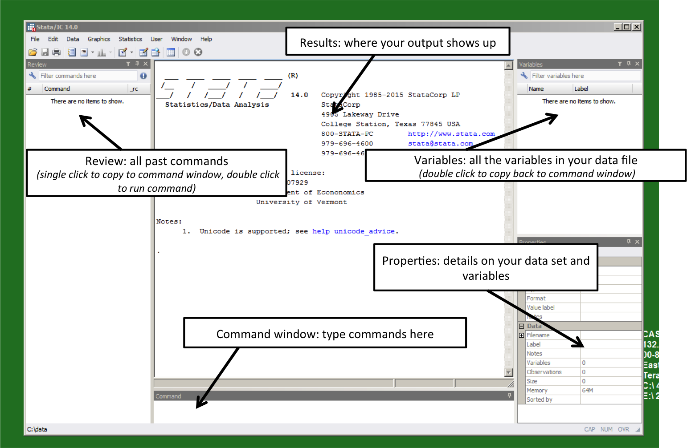
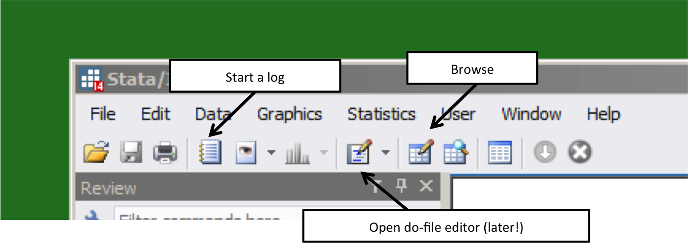

Version: Spring 2018\
EC200 Econometrics and Applications

**Stata Lab 1: Introduction**[^1]\

Summary {#summary .unnumbered}
=======

General command structure:

Key commands  {#key-commands .unnumbered}
------------

\|l \|l \|p0.5\| &`log using logfile1.log`& open and log using
`logfile1.log`\
&`log close` & close log\
& `use dataset.dta, clear` & open dataset `dataset.dta `, clear out old
one\

3 &`describe var1 var2 ... ` & charcteristics of `var1`, `var2`, etc.\

4 & `browse var1 var2 ... ` & open data browser, display
`var1, var2 .. `\
5 & `lookfor text1 ` & search for *text1* in variable
names/descriptions\
& `tabulate var1 ` & make a frequency table of `var1`.\
& `tabulate var1 var2` & make a cross-tabulation of `var1` and ` var2`.\
& `summarize var1 ` & descriptive statistics for `var1`.\
& `summarize var1 , detail` & detailed descriptive statistics for
`var1`.\
& `help command ` & open help files for `command`.\

Logic statements  {#logic-statements .unnumbered}
----------------

  -------------------------- ----------------------------------------
  and                                           &
  or                          $|$ (vertical bar, on same key as "/")
                             
  equal to                                      ==
  not equal to                                  !=
                             
  greater than                                  \>
  less than                                     \>
  greater than or equal to                     \>=
  less than or equal to                        \<=
  -------------------------- ----------------------------------------

-   `tab bac10 if gdl==1 & sl70plus == 0`: Tabulates the variable
    `bac10` but only if `gdl` equals one *and* `sl70plus` equals 0

-   `tab bac10 if year >=2000`: Tabulates the variable `bac10` for the
    years 2000, 2001, 2002, etc.

-   `tab bac10 if year !=2000`: Tabulates the variable `bac10` for every
    year *but* 2000

-   `tab bac10 if year < 2008 & year > 2005`: Tabulates the variable
    `bac10` 2006 and 2007

-   `tab bac10 if year < 2008 | year > 2005`: Tabulates the variable
    `bac10` is less than 2008 OR greater than 2005 (all years!)

Objectives {#objectives .unnumbered}
==========

By the end of this tutorial you should be able to complete the following
tasks in Stata:

-   Identify key areas of the Stata interface

-   Open a data file

-   Summarize and tabulate data

-   Create and save a log file

-   Open, view, and save a data file

-   How to get help with Stata

Hey, Stata. It's nice to meet you
=================================

Start by opening Stata. You should have a window that looks something
like this (on a PC):

You should now have the Stata window open. There is a set of pull down
menus as well as 4 smaller windows: Review, Variables, Results, and
Command.

Also especially helpful are the following buttons:

Log files
=========

If you want to record anything that you do in a STATA session so that
you can look at results or commands later, you need to open a log-file.
A log-file is simply a record of all the commands you enter into STATA
and the output from those commands. The key is to make sure you have a
log file open at the beginning of a STATA session, and to close it once
you have finished, and before you close STATA.

There are three ways you can open a log file:

1.  Go to the **FILE** dropdown menu, choose **Log**, choose **Begin**.
    You should see a "Begin Logging Stata Output" dialog box. Browse to
    a directory where you can store your log file and type in the
    following file name in the File Name space: `lab1.log`

2.  Click on the log icon at the top of the STATA workspace (right of
    the print button). When you click on the log button, the "Begin
    Logging Stata Output" dialog box pops up. Name your log file as
    above.

3.  You can open a log file by typing the following in the Stata command
    window: `log using lab1.log, replace`

    The `, replace` is optional. If you add it as an **option**, your
    new file will overwrite your old one. Or, you can add `, append` to
    add it to the bottom of your old log file.

*Tip: Use extension .log, NOT the default .smcl. This will make it
easier for you to edit, cut and paste your log in any text editor.*

Now that you have a log file open, we can start our STATA session.

Opening data files
==================

Stata data files end with the extension `.dta`, and they can only be
read by Stata. You can import text files and excel files into Stata, and
you can export `.dta` files into text files or Excel files, but we'll
cover this later.

There are three ways to open a data file:

1.  In the file browser, double click on the data file you want to open

2.  Use the **FILE/OPEN** drop down menu in Stata and open the data set
    name `driving.dta` that you copied into your folder. Note that in
    the command window, the `use` command appears. We'll use that one
    later.

3.  Type `use filename.dta,clear` into the command window

Download `driving_2004.dta`, from Blackboard and open it. This is a data
file of driving laws, vehicle accidents, and fatalities in the United
States in 2004.

You should now see the list of variables appear in the Variables window,
with the variable name, variable label, and some other information.

Looking at data
===============

Let's take a more detailed look at the variables in the dataset.

In the command window type: `describe`

At the top of the output you will see some overall features of the file,
including the number of variables. Below that you will see a list of
every variable, including the variable name, the "storage type" (byte,
float, int, etc.) and the variable label. If you see `–more–` at the
bottom of your screen, press the space bar to continue scrolling.

To learn more about the variables and the organization of the data, use
the `browse` command. Type: `browse` (or click on the "browse" button).

Another approach is to add a variable list to the browse command. Type
the following:

`browse year sl70plus bac10 bac08 gdl`

*Again, note that you can also double click on the variable names so you
don't have to type them all!*

This command directs you to a spreadsheet inside Stata where the data
appears. This looks a lot like an Excel spreadsheet!

Note the following:

-   Each observation appears on a separate row of the spreadsheet, which
    represents data from a certain year and a certain state. For example
    the first row is for state 1 (Alabama) in 1980. If you move along
    the row, you can see other characteristics about Alabama in 1980.

-   Each variable appears in a separate column, and the name of the
    variable is at the column heading.

How many observations are there? What type of data set is this?

Examining variables
-------------------

Let's look at the variables that are included in the data set. There is
an efficient way to find the names of variables you are interested in.
Suppose you are interested in a variable related to alcohol laws. Type
in:

`lookfor alcohol`

This will give you a list of all the variables that have "alcohol" in
either their variable name or variable label. In this case, two
variables appear - `bac10` and `bac08`.

You can also experiment with all possible combinations of the col, row,
and cell options, and add the `nofreq` option to suppress the number of
observations. Use help for details:

`help tab`

\

When you are analyzing variables, you will want to think carefully about
whether you should be looking at row percentages, column percentages, or
cell percentages.

Lab Exercise
============

1.  How many states have graduated drivers license laws (GDLs)? How many
    states have speed limits of 70 mph or higher (including no speed
    limit)?

2.  What percentage of states with GDLs *and* with low speed limits
    (below 70 mph) have blood-alcohol limits of 0.10 (the more lenient
    level)? *Note that some states have blood-alcohol limit for a
    fraction of a year. If so, consider having a limit of 0.10 in place
    for part of the year as having a limit*

3.  What is the mean fatality rate per 100 million miles across all
    states? What is the standard deviation?

4.  What was the fatality rate (deaths per 100 million miles) in
    Vermont? (Vermont is state 46)

5.  Generate a variable $Y$ equal to one if a state has a fatality rate
    per 100 million miles that is above the mean, and zero otherwise.
    What is $E(Y)$?

6.  Write a joint probability distribution table for the following two
    random variables: $X$, a random variable equal to one if a state has
    a speed limit of 70 or greater and zero otherwise (see `sl70plus`),
    and $Y$, the random variable developed in the previous part.

7.  *Look up the command `correlate` in the help files*: What is the
    correlation coefficient between nighttime fatalities per 100,000
    population and weekend accidents per 100,000 population? Why might
    this correlation be so strong?

[^1]: This lab draws heavily on Anne Fitzpatrick's (UMass-Boston)
    excellent materials.
